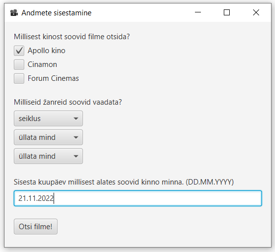

# CinemaScraper

The goal of the project is to simplify the process of finding a suitable movie to watch in the cinema by:

* creating a web scraper to gather information from different cinema websites
* combining the information and providing a user interface for filtering out the perfect movie

This way the user does not need to visit the each of the cinema websites to search manually. The scraped information can be filtered according to a specific cinema, time and movie genre. An example of the described user interface can be seen below (in Estonian).

